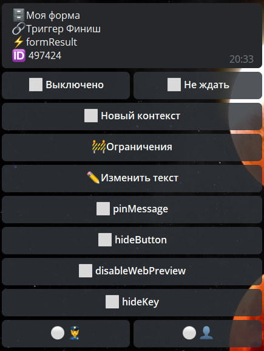

## QNext. реакция formResult

formResult - данная реакция работает в связке с модулем 🗄Формы

Результаты заполненной формы можно отобразить установив данную реакцию в 🔗Триггере Финиш, в 🗄Формах.

В настройках этой реакции доступен пункт «✏️Изменить текст».

Текстом реакции могут быть все доступные макросы и переменные. Для того, чтобы отобразить в тексте результата формы заполненные пользователем поля используется переменная ${formResult.fieldsText}.

По умолчанию, результаты формы отображаются в стандартном виде.

Также в настройках реакции доступны функции:

— pinMessage - закрепить сообщение

— hideButton - кнопка скрыть пост

— disableWebPreview - отключить предосмотр ссылок содержащихся в результатах.

— hideKey - скрывает название поля.

Результат формы в виде workflow отправленный в группу доступен:

👮‍♀️🔘 - администратору

👤🔘 - пользователям

[QNext. Форма](/docs-test/admin/forms-about)

