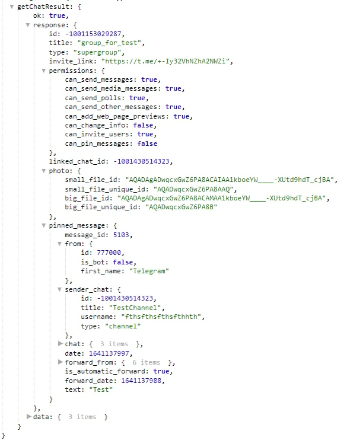

**getChat** - получить информацию о чате. 


Чаты/Каналы - указываем чат в котором необходимо выполнить действие

Информация о чате будет доступна в переменной:
_${getChatResult}_


```plain
[**getChat method bot.api** ](https://core.telegram.org/bots/api#getchat
```


