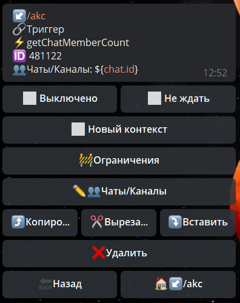
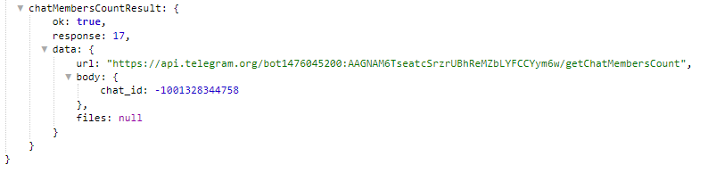

## QNext реакция getChatMemberCount

**getChatMemberCount** -получить количество участников в чате.



Чаты/Каналы - указываем чат в котором необходимо получить информацию.

Информация доступна в переменной: 
_${chatMembersCountResult}_




```plain
[**getChatMemberCount method bot.api**](https://core.telegram.org/bots/api#getchatmember
```


