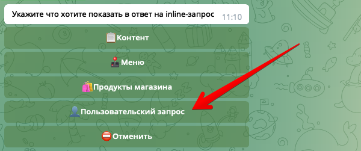
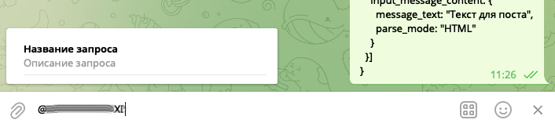
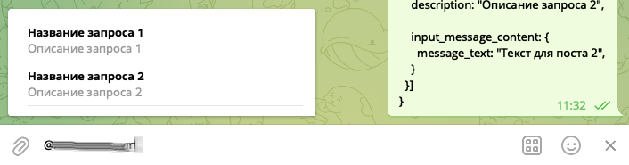
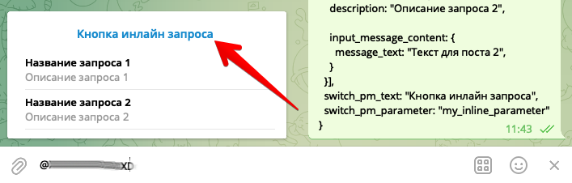

Реакция ⚡️inlineAnswer служит для произвольного собственного ответа на инлайн запрос. Чтобы иметь возможность выполнить эту реакцию вам необходимо создать 🖋инлайн-запрос с типом 👤Пользовательский запрос:



У инлайн-запросов есть 2 триггера:
* 🔗Триггер Запроса - выполняется в момент когда пользователь вводит свой запрос в поле ввода
* 🔗Триггер Выбора - выполняется когда пользователь выбирает что либо из предложенного списка.

Реакция ⚡️`inlineAnswer` доступна только в 🔗Триггере Запроса. При создании реакции, бот попросит указать путь до переменной где лежит ответ, укажите например путь до локальной переменной: `${localVar.myAnswer}`. Чтобы реакция отработала без ошибок, перед реакций ⚡️`inlineAnswer` должна быть другая реакция, которая создает локальную переменную `myAnswer`. Создать эту переменную вы можете с помощью реакций localVarSet или runScript. 

Формат переменной, которую вы отдаете в реакцию ⚡️`inlineAnswer` должен совпадать с форматом запроса **Telegram bot api** метода [answerInlineQuery](https://core.telegram.org/bots/api#answerinlinequery):
* Параметр **results** является обязательным.
* Параметр **inline_query_id** передавать не обязательно, бот сам его подставит как надо.
* Все остальные параметры на ваше усмотрение и не являются обязательными.

Например чтобы ответить в инлайн-запросе обычным текстовым сообщением, используйте следующую переменную:
```js 
{
 results: [{
  type: "article",
  id: "1",
  title: "Название запроса",
  description: "Описание запроса",

  input_message_content: {
   message_text: "Текст для поста"
  }
 }]
}
```

В этом случае запрос будет выглядеть так:



А после выбора, вы получите такой пост:


⚠️Обратите внимание что параметр results - это массив, а это значит что можно передать сразу несколько результатов, например так:
```js 
{
 results: [{
  type: "article",
  id: "1",
  title: "Название запроса 1",
  description: "Описание запроса 1",

  input_message_content: {
   message_text: "Текст для поста 1",
  }
 }, {
  type: "article",
  id: "2",
  title: "Название запроса 2",
  description: "Описание запроса 2",

  input_message_content: {
   message_text: "Текст для поста 2",
  }
 }]
}
```

Результат выполнения:



⚠️Обратите внимание, у каждого результата в массиве results должен быть свой уникальный id, иначе вы получите ошибку от Telegram.

В [документации](https://core.telegram.org/bots/api#answerinlinequery) сказано что запрос answerInlineQuery имеет множество параметров, которые вы можете использовать:
```js 
{
 results: [],
 cache_time: 10000,
 is_personal: false,
 next_offset: "",
 switch_pm_text: "",
 switch_pm_parameter: ""
}
```
* cache_time - время кеширования запроса, на это время сервер Telegram закеширует ваш запрос
* is_personal - если передать значение true, тогда кеширование произойдет только для того пользователя, который выполнил этот запрос
* next_offset - этот параметр необходим, если у вас есть большое количество ответов, и вы хотите их отдавать постранично.
* switch_pm_text - текст для кнопки, которая отображается вместе с результатом инлайн-запроса.
* switch_pm_parameter - параметр, который вы получите вместе с командой /start, когда пользователь нажмет на кнопку switch_pm_text.

Кнопка switch_pm_text выглядит так:




