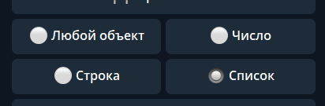
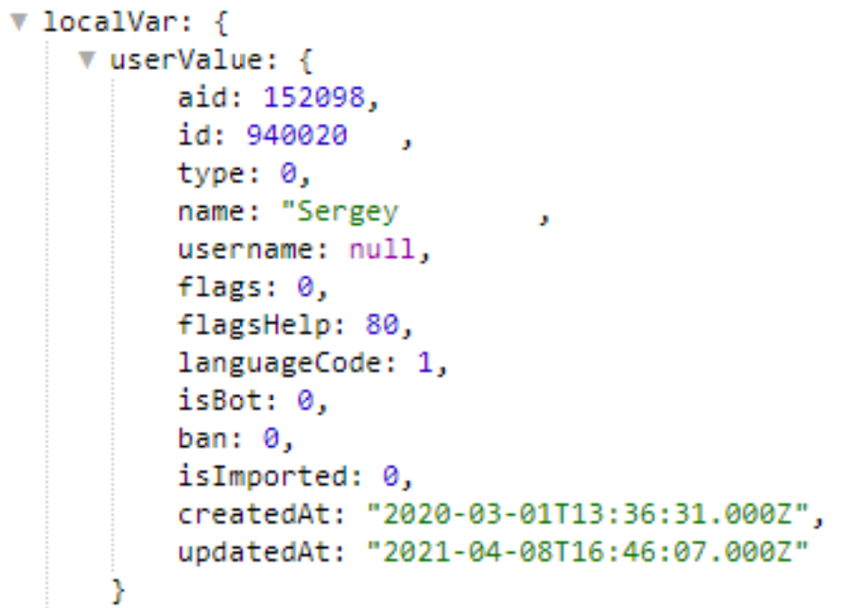
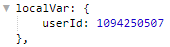
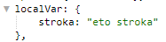
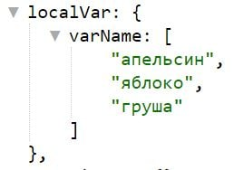

## QNext. Локальные переменные

**Локальные переменные** — переменные, которые можно создавать (присваивая им значения), изменять их значения и удалять  в процесс работы триггера. Локальные переменные доступны с момента создания и до завершения работы любого триггера, включая Глобальный Триггер После. (Который всегда выполняется последним).

Например: переменная созданная в Триггере До меню, будет доступна в Триггере Раздела и в Триггере После. После завершения выполнения Глобального Триггера После, локальная переменная удаляется.

Предоставляется 4 типа локальных переменных:

* **Любой объект** - значение типа объект. Объект — это набор свойств, и каждое свойство состоит из имени и значения, ассоциированного с этим именем. Например: { фрукт: "апельсин"; вес: 250; цена: 51.20; }*
* **Число** - числовые значения. Например: 123 или 567.89 **
* **Строка** - текстовые значения. Например: "апельсин" или " яблоко это не груша" ***
* **Список** - список текстовых или числовых значений, массив. Данные в списке хранятся по численным ключам, первый элемент списка имеет ключ 0, второй - 1 и т.д. 

— Для примера рассмотрим переменную varName, тип: Список, значение: [апельсин, яблоко, груша].

— Для получения значения переменной varName, используем: 

— При обращении к переменной ${localVar.varName} получим ее значение в виде списка: апельсин, яблоко, груша

— При обращении к первому элементу переменной ${localVar.varName.0} переменная вернет значение первого элемента списка: апельсин.

— При обращении ко второму элементу переменной ${localVar.varName.1} переменная вернет значение второго элемента списка: яблоко.

— Для того, что бы узнать количество элементов в списке: ${localVar. varName.length} переменная вернет значение 3, на единицу превосходящее ключ списка.

 * [**localVarAdd** ](/docs-test/reactions/localvaradd)- Добавить значение в локальную переменную
 * [**localVarDel**  ](/docs-test/reactions/localvardel)- Удалить локальную переменную
 * [**localVarSet** ](/docs-test/reactions/localvarset)- Установить локальную переменную

Примеры:

Любой объект *

** Число

*** Строка

**** Список

