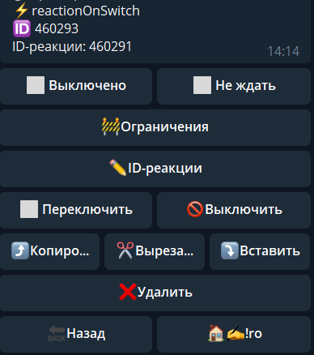
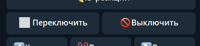
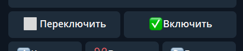
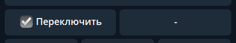

## QNext реакция reactionOnSwitch

**reactionOnSwitch -** изменение статуса работы реакции. Для указания реакции необходимо знать его ID. ID реакции указывается под ее названием.

Поддерживает 3 режима работы:

Выключить (по умолчанию) - выключает указанную реакцию

Включить - включает указанную реакцию

Переключить - меняет актуальное состояние реакции: вкл - выкл, и обратно: выкл - вкл.

[QNext. Перечень реакции](/docs-test/reactions)

