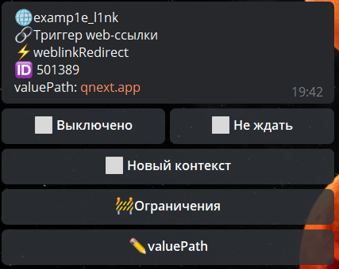

## QNext реакция weblinkRedirect

**weblinkRedirect** - реакция позволяет перенаправить пользователя на другой адрес. Адрес можно указать сразу в реакции, или с помощью переменной, которая будет отдавать ссылку.

Реакция предусмотрена для раздела: 
```plain
WEB — web - ссылки — триггер Web-ссылки```




[QNext. WEB](/docs-test/admin/web-about)

[QNext. Перечень реакции](/docs-test/reactions)


  
[Original](https://telegra.ph/QNext-admin-reaction-redirectUrl-11-25)