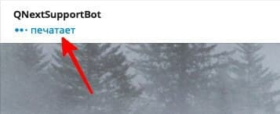

## QNext. реакция sendChatAction

**sendChatAction** — реакция сообщит пользователям бота или чата о том, что бот, что то пишет, как показано на скриншоте.

Реакцию можно использовать например если вы хотите актуализировать статусы своих пользователей (юзер заблокировал бота, аккаунт удален и др.) с помощью рассылки, но при этом ничего не отправляя в личку пользователям.

[QNext. Перечень реакции](/docs-test/reactions)

  
[Original](https://telegra.ph/QNext-admin-reaction-sendChatAction-05-09)