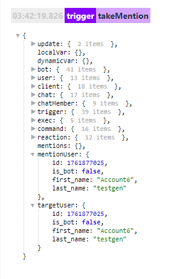

# takeMentions
**takeMentions** - взять пользователя(ей) для дальнейшей работы. 

Пример использования:

Команда: /!take (.+)/i

Реакции:

— takeMentions 

— — log

Если необходимо исключить пользователя из чата, нам потребуется:

Команда: /!take (.+)/i

Реакции:

— takeMentions

— — takeChat
 
— — — kickChatMember

**Особенности:**
* Работает только юзернеймами (@username) и меншенами (mention: Account6 testgen)
* Не работает с ID (123456789)

Если необходимо использовать @username и ID, подойдет:

[**реакция: takeUsers**](/docs-test/reactions/takeusers)

