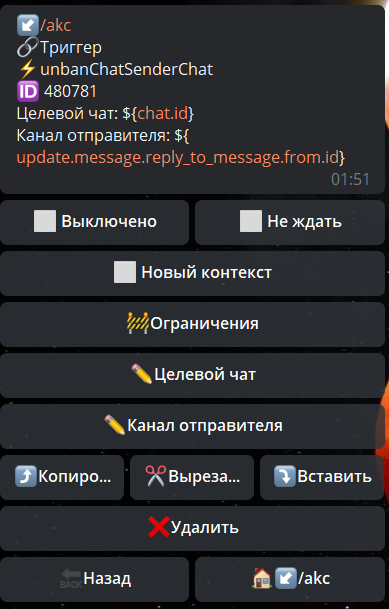

## QNext реакция unbanChatSenderChat

**unbanChatSenderChat -** разблокировать канал в чате.

Целевой чат - путь в котором будет указан id чата где надо заблокировать канал

Канал отправителя - путь по которому указан ID канала

[QNext. Чаты](/docs-test/admin/chat-about)

