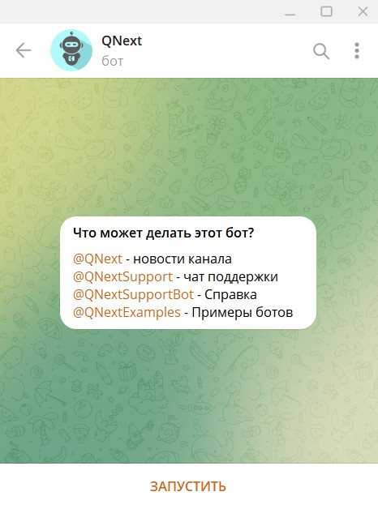
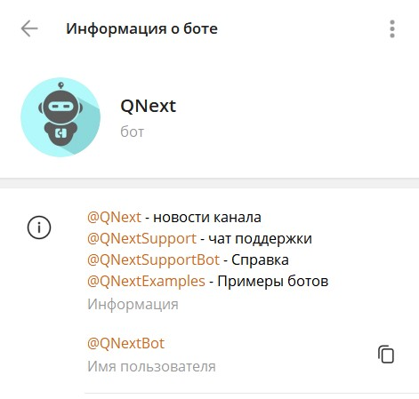
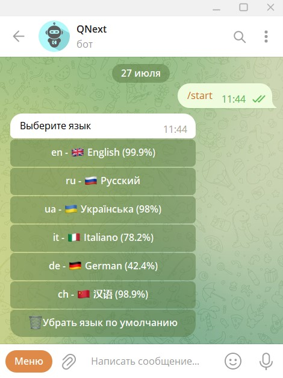
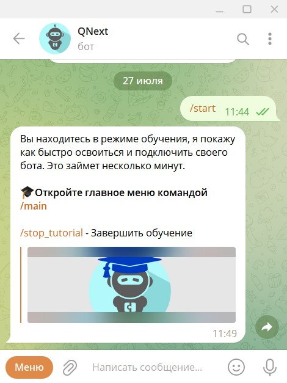
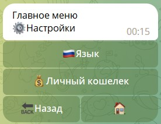
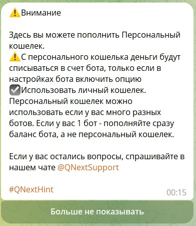
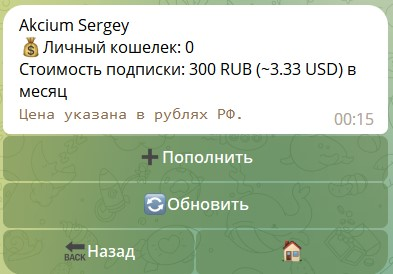
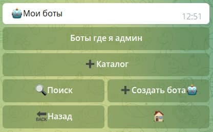
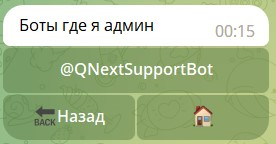
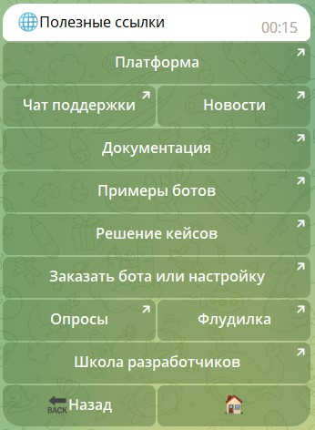

# [QNextbot. Знакомство](/docs/root/getstarting/acquainqnext/)

**[Qnextbot](http://t.me/Qnextbot)** - основной бот платформы QNext. В нем производятся все главные процессы: подключение бота, обновление токена, оплата, передача бота другому лицу, и т.д.

::: details Профиль бота

:::

1. Нажимаем на кнопку "ЗАПУСТИТЬ". Бот нас приветствует сообщением, в котором предлагает выбрать язык.

2. Получаем от бота сообщение о том, что мы в режиме обучения: 

3. Нажимаем на команду `/main` и перед нами появляется главное меню бота.

Бот отправит нам сообщение, к которому прикрепит 3 кнопки:

* [Настройки](./#настроики)
* [Боты](./#боты)
* [Полезные ссылки](./#ссылки)

#### Настройки

В разделе настройки, нам доступны 2 кнопки:

* Одноименная кнопка "Языки", как при первом запуске бота, которая определяет язык для всех ваших ботов.
* Личный кошелек, в котором можно пополнить баланс для оплаты подключенных ботов.

::: details Оповещение

:::

#### Боты

В этом разделе будут отображаться все созданные вами боты, владельцем которых вы являетесь. 

Так же, можно увидеть ботов, в которых вам выдан доступ администратора.

#### Ссылки

В этом разделе доступны ссылки на полезные ресурсы проекта, в том числе на документацию проекта.

