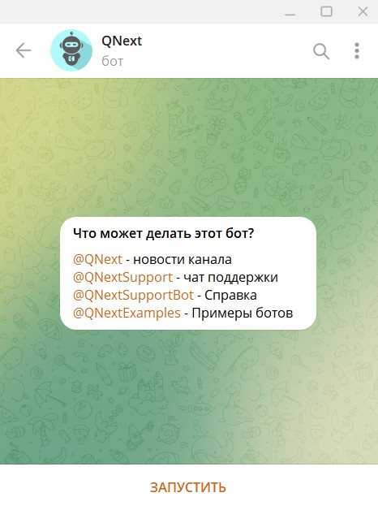
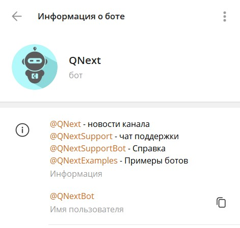
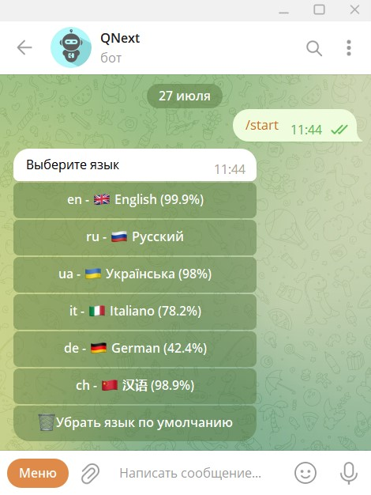
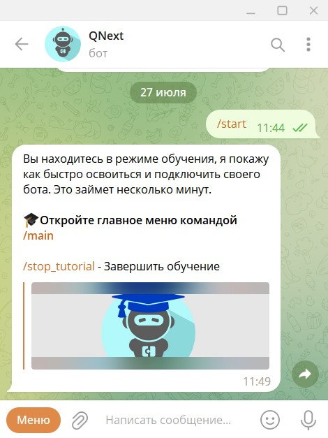
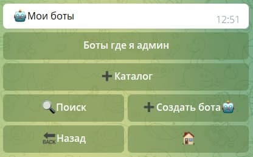
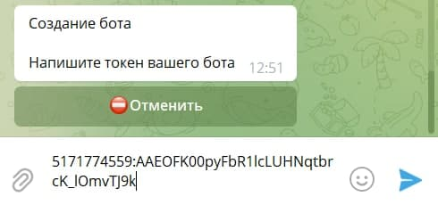
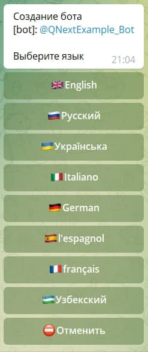
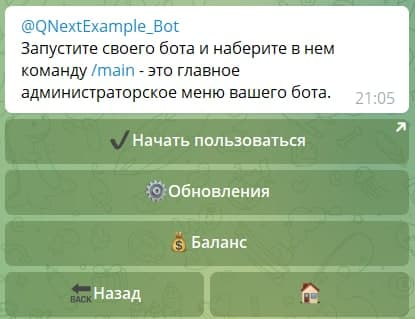

# [QNextBot. Подключение бота](/docs/root/getstarting/addbottoqnext/)

**[Qnextbot](http://t.me/Qnextbot)** - основной бот платформы QNext. В нем производятся все главные процессы: подключение бота, обновление токена, оплата, передача бота другому лицу, и т.д.

::: details Профиль бота

:::

1. Нажимаем на кнопку "ЗАПУСТИТЬ". Бот нас приветствует сообщением, в котором предлагает выбрать язык.

2. Получаем от бота сообщение о том, что мы в режиме обучения

Подробнее по работе с ботом и обучению можно ознакомиться по ссылке: [Знакомство с Qnextbot](/root/getstarting/acquainqnext/)

3. По этому нажимаем на команду `/main` и нам открывается главное меню бота

4. Нажимаем на кнопку **Создать бота**

5. В открывшемся окне вводим ранее скопированный токен

7. Выбираем язык на котором будет административный интерфейс бота

**Готово!** Можно приступать к работе.

8. Далее переходим в чат с ботом, нажав на имя бота и запускаем нашего бота.

Для вызова меню администратора, используем команду `/main`