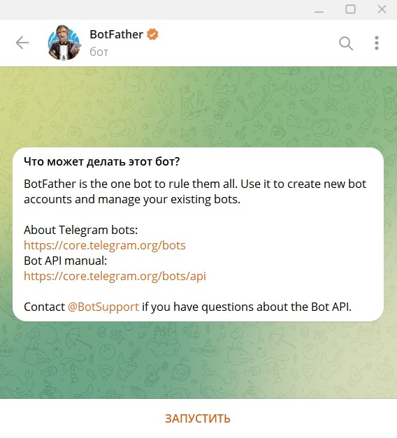
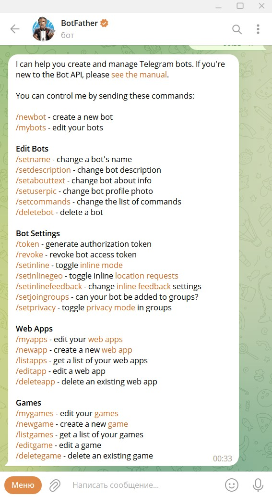
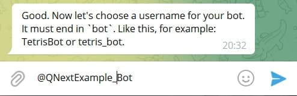
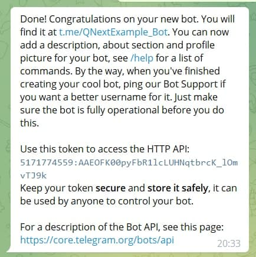

# [BotFather. Регистрация бота](/docs/root/getstarting/registrationinbotfather/)

[BotFather](http://t.me/botFather) — это официальный Telegram бот, который создает и регистрирует все боты в Telegram.



::: details Профиль бота

:::

Нажимаем на кнопку "ЗАПУСТИТЬ". Бот нас приветствует сообщением, в котором выводит все доступные команды.

::: details

:::

Нас интересует команда: ```/newbots```. Вводим команду в чат и отправляем.

1. Бот нас попросит придумать имя для своего бота. 

::: tip Важно
* Не стоит путать имя с юзернеймом. Юзернейм бот запросит следующим шагом.
* Имя бота можно менять в любое время
:::


2. Следующим вопросом бота будет задача - придумать юзернейм боту. Здесь вам необходимо придумать юзернейм вашему будущему боту. Формат юзернейма: @Название+bot

::: danger Важно
**Юзернейм бота поменять нельзя**
:::



**Поздравляем, ваш бот зарегистрирован!**



Для привязки вашего бота к сервису [Qnextbot](http://t.me/Qnextbot) будет необходимо ввести API ключ в соответствующее окно в личном кабинете.

**API ключ — секретный код, который позволяет настроить связь с ботом вне клиента Telegram.**

Вот это наш токен: ``5171774559:AAEOFK00pyFbR1lcLUHNqtbrcK_lOmvTJ9k```

[Подключение бота в QnextBot](/root/getstarting/addbottoqnext/) мы разберем в отдельной статье.