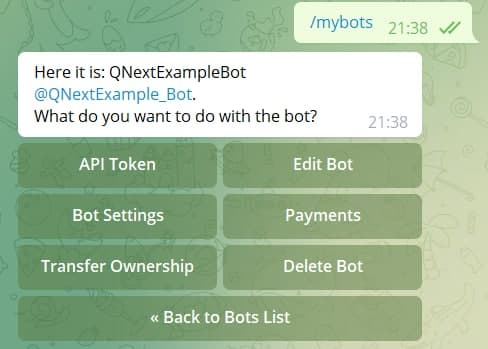
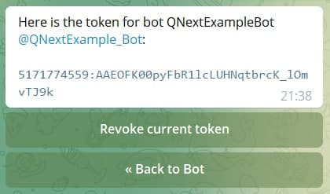
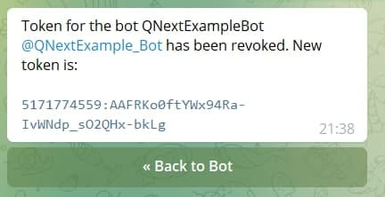

# [BotFather. Обновление токена](/docs/root/getstarting/resettokenbotfather/)

Подробнее о [Регистрация бота в BotFather](/root/getstarting/registrationinbotfather/) можно изучить в статье по ссылке.

Здесь мы рассмотрим вопрос обновления токена в ранее созданном боте.

Для этого, заходим в бота: [BotFather](http://t.me/botFather)

Вводим команду: `/mybots`

Выбираем нашего бота, чей токен нужно обновить, и нажимаем на кнопку с юзернеймом вашего бота.

Здесь нас интересует кнопка: **API Token**, нажимаем, заходим в раздел:

Нажимаем на кнопку: **Revoke current token**

Получаем новый токен, его нам необходимо скопировать.

После копирования токена, заходим в бота [Qnextbot](http://t.me/Qnextbot)

Как [обновить токен в QnextBot](/root/getstarting/resettokenqnextbot/) рассмотрим в следующей статье.