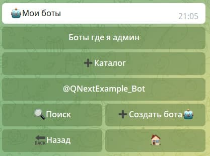
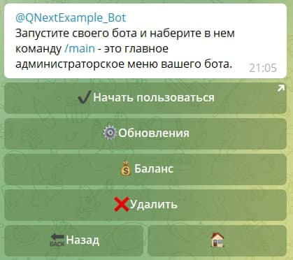
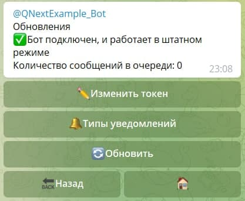
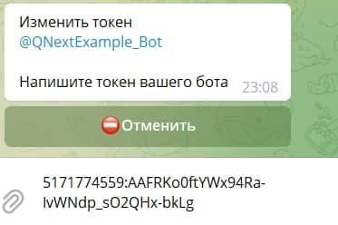

# [QnextBot. Обновление токена](/docs/root/getstarting/resettokenqnextbot/)

Открываем бота **[Qnextbot](http://t.me/Qnextbot)**.

Нажимаем на кнопку "Боты"

Выбираем нужного бота

Здесь нам потребуется кнопка "**Обновления**"

Видим кнопку "**Изменить токен**"

Вводим ранее скопированный токен

Готово! Вы молодцы!

