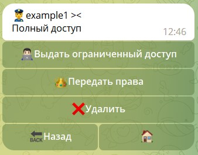

# Передача прав на бота

## Передача прав в [QNextBot](https://t.me/qnextbot)

Для передачи прав владельца бота в [QNextBot](https://t.me/qnextbot) необходимо выполнить одно условие:

**Владелец бота, и аккаунт которому передают бота, должны запустить вашего бота.**

После выполнения требования, владелец чата должен перейти по пути:

```plain
/main — Люди — Администраторы — Выбрать администратора — "передать права" — Подтвердить
```

::: details Подробнее

:::

::: danger Предупреждение!
**Передача необратима! Передачу нельзя отменить. После передачи вы потеряете доступ к управлению ботом от имени владельца.**
:::

## Передача прав в [BotFather](https://t.me/botfather)

Для передачи прав владельца бота в [BotFather](https://t.me/botfather) необходимо выполнить следующие условия:

* Владелец бота, и аккаунт которому передают бота, должны запустить вашего бота. 
* В случае если запуск был произведен ранее, аккаунту получателю бота, необходимо отправить хотя бы 1 сообщение 
в личку боту, перед передачей бота.
* У владельца аккаунта должна быть включена двухфакторный пароль (он же облачный пароль) в разделе конфиденциальности.
* Аккаунт получателя бота должен иметь @username ИЛИ владелец бота должен добавить получателя бота к себе в контакты:

::: details Подробнее

:::

После выполнения требования, владелец чата должен перейти по пути:

Перейти в бота [BotFather](https://t.me/botfather) и далее:

```plain
/mybots — выбрать бота — transfer ownership — choose recipient — отправить контакт или @username — Yes, i am sure, proceed. — ввести свой пароль.
```

::: danger Предупреждение!
**Передача необратима! Передачу нельзя отменить. После передачи вы потеряете доступ к управлению ботом от имени владельца.**
:::