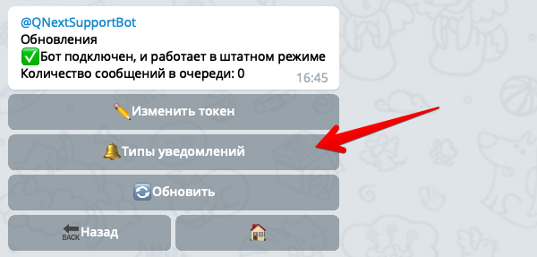
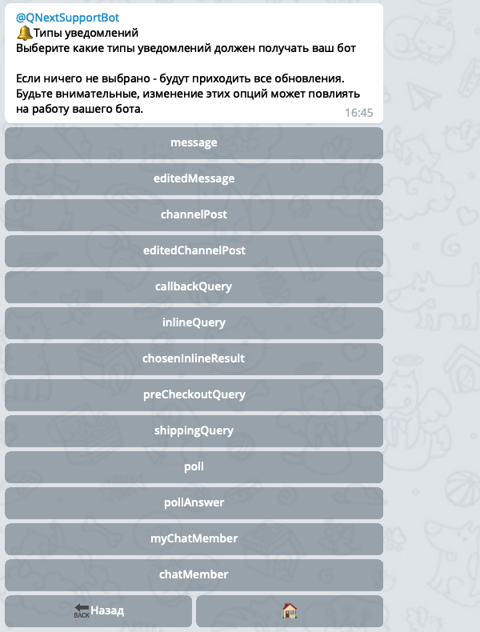
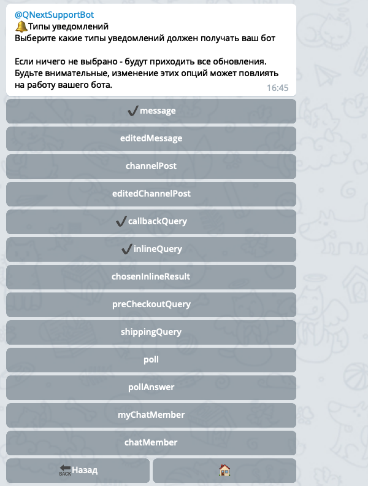

## QNext. Типы уведомлений
```plain
⚠️ Будьте внимательны при редактировании этого раздела, работоспособность бота может быть нарушена, редактируйте только если знаете что делаете.```

В настройках вашего бота внутри [@QNextBot](https://t.me/qnextbot) есть раздел: `⚙️Обновления -> 🔔Типы уведомлений`:



В этом разделе вы можете указать платформе, какие типы уведомлений необходимо получать от телеграм:



Вы можете выбрать те разделы, которые вы хотите включить, и тогда они будут отмечены галочкой:



В этом примере выбраны 3 типа уведомлений: **message**, **callbackQuery** и **inlineQuery**. Это значит что телеграм будет присылать уведомления только этих трех типов.

По умолчанию ничего не выбрано, это означает что бот будет получать все типы  уведомлений. 
### Что означают типы уведомлений?
* message - любое текстовое сообщений в чате
* editMessage - уведомлений о том, что сообщение было отредактировано
* channelPost - новый пост в канале
* editChannelPost - редактирование поста в канале
* callbackQuery - нажатие на кнопку
* inlineQuery - использование бота в inline-режиме
* chosenInlineQuery - выбор чего-либо в inline режиме
* preCheckoutQuery - подтверждение оплаты
* shippingQuery - подтверждение адреса доставки при оплате
* poll - новый встроенный telegram-опрос
* pollAnswer - ответ в telegram-опросе
* myChatMember - изменение статуса юзера в личке с ботом
* chatMember - изменение статуса юзера(бота) в чате
* chatJoinRequest - запросы на вступление в чаты/каналы


[QNext. Документация](/docs-test/)


  
[Original](https://telegra.ph/QNext-Root-Notifications-06-17)